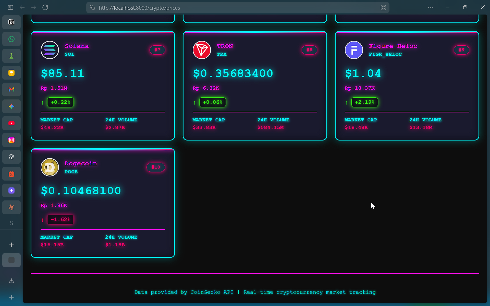
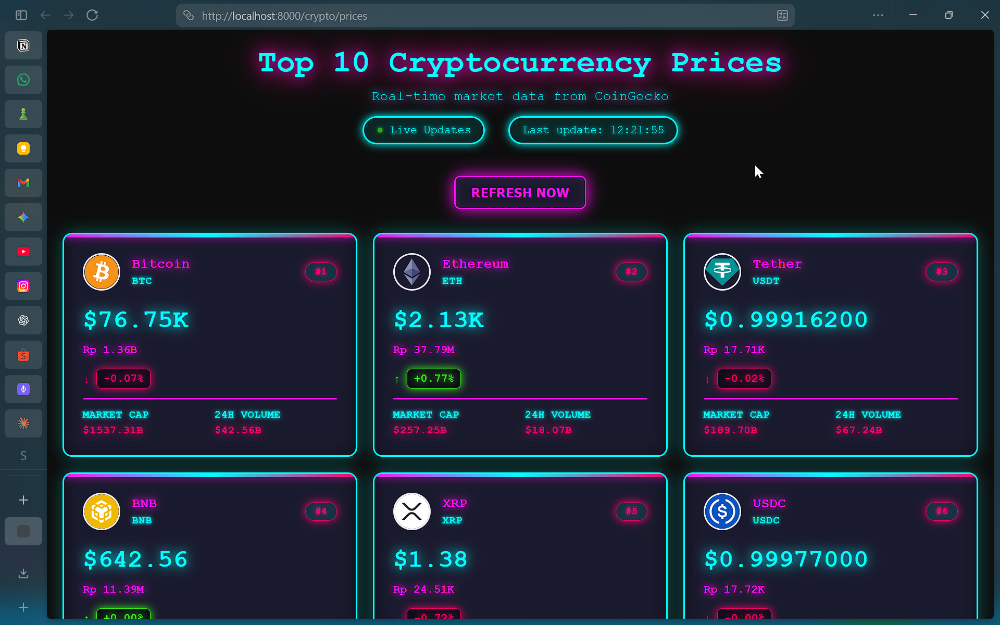

<br />
<div align="center">
  <a href="https://github.com/afat45/PBW-Api-Laravel-Btc">
    
  </a>

  <h3 align="center">PBW API Laravel - BTC</h3>

  <p align="center">
    RESTful API berbasis Laravel untuk manajemen dan layanan data terkait Bitcoin (BTC).
    <br />
    <strong>Real-time tracking, transaction management, dan analytics dalam satu platform.</strong>
    <br />
    <br />
    <a href="#-dokumentasi-api"><strong>Jelajahi Dokumentasi »</strong></a>
    ·
    <a href="#-fitur-utama"><strong>Lihat Fitur</strong></a>
    ·
    <a href="#-panduan-instalasi-getting-started"><strong>Setup Guide</strong></a>
    <br />
    <br />
  </p>
</div>

## 📸 Hasil & Dokumentasi

### 1. Interface Aplikasi Client

*Gambar 1: Dashboard dan interface aplikasi yang mengkonsumsi API ini.*

### 2. Testing Endpoint & Response

*Gambar 2: Response dan testing endpoint menggunakan Postman/Insomnia.*

---

## ✨ Fitur Utama

* **RESTful Architecture** - Desain API yang clean dan mengikuti standar REST untuk kemudahan integrasi
* **Real-time Data Management** - Sistem tracking data Bitcoin dengan update real-time
* **Transaction Management** - Kelola dan monitor transaksi BTC dengan detail lengkap
* **JSON Response Standard** - Format balasan yang konsisten dan mudah di-parse oleh berbagai client
* **Authentication & Authorization** - Implementasi Sanctum untuk API authentication yang aman
* **Error Handling** - Error handling yang comprehensive dan informative
* **Database Optimization** - Menggunakan Eloquent ORM dengan query optimization
* **Soft Deletes** - Data deletion yang aman dengan soft delete mechanism

## 🛠️ Teknologi & Dependencies

### Backend
* [Laravel 11](https://laravel.com/) - Modern PHP framework untuk RESTful API
* [PHP 8.2+](https://www.php.net/) - Bahasa pemrograman backend yang powerful
* [MySQL 8.0](https://www.mysql.com/) - Database management system yang reliable
* [Composer](https://getcomposer.org/) - Dependency manager untuk PHP

### Development Tools
* [Vite](https://vitejs.dev/) - Frontend build tool (untuk asset processing)
* [Postman/Insomnia](https://www.postman.com/) - API testing & documentation
* [PHPUnit](https://phpunit.de/) - Testing framework

### Key Packages
* **Laravel Sanctum** - Authentication untuk API
* **Eloquent ORM** - Query builder & ORM
* **Laravel Migrations** - Database versioning
* **Laravel Artisan** - Command line interface

## 🚀 Panduan Instalasi (Getting Started)

Untuk menjalankan proyek ini, ikuti langkah-langkah di bawah. Pastikan semua requirement sudah terpenuhi sebelum memulai.

### ✅ Prasyarat

Sebelum memulai, pastikan sudah terinstal:
* **PHP** (versi 8.2 atau lebih baru) - Check dengan `php -v`
* **Composer** - Package manager PHP ([Download di sini](https://getcomposer.org/download/))
* **MySQL/MariaDB** - Database server (bisa menggunakan Laragon, XAMPP, atau Docker)
* **Git** - Version control ([Download di sini](https://git-scm.com/))

### 📋 Langkah-Langkah Instalasi

#### 1. Clone Repository
```sh
git clone https://github.com/afat45/PBW-Api-Laravel-Btc.git
cd PBW-Api-Laravel-Btc
```

#### 2. Install Dependencies
```sh
composer install
```
Tunggu sampai selesai, ini akan menginstall semua package yang diperlukan.

#### 3. Setup Environment File
```sh
cp .env.example .env
```
Edit file `.env` dan sesuaikan konfigurasi database:
```env
DB_CONNECTION=mysql
DB_HOST=127.0.0.1
DB_PORT=3306
DB_DATABASE=btc_database
DB_USERNAME=root
DB_PASSWORD=
```

#### 4. Generate Application Key
```sh
php artisan key:generate
```
Perintah ini akan generate encryption key untuk aplikasi.

#### 5. Setup Database
Buat database baru di MySQL:
```sql
CREATE DATABASE btc_database;
```

Kemudian jalankan migration:
```sh
php artisan migrate
```

#### 6. (Optional) Seed Database
Jika ingin menambah data dummy untuk testing:
```sh
php artisan db:seed
```

#### 7. Start Development Server
```sh
php artisan serve
```
Aplikasi akan berjalan di `http://localhost:8000`

### 🐳 Alternative: Running with Laragon
Jika menggunakan Laragon:
1. Copy folder project ke `C:\laragon\www`
2. Buka Laragon, klik "Start All"
3. Right-click project → "Open Terminal Here"
4. Jalankan command di atas starting from step 2

---

## 📡 API Documentation

### Base URL
```
http://localhost:8000/api
```

### Endpoints Overview

#### 1. Bitcoin Data Management

| Method | Endpoint | Deskripsi |
|---|---|---|
| `GET` | `/btc` | Get semua data Bitcoin |
| `GET` | `/btc/{id}` | Get detail Bitcoin by ID |
| `POST` | `/btc` | Create Bitcoin data baru |
| `PUT/PATCH` | `/btc/{id}` | Update Bitcoin data |
| `DELETE` | `/btc/{id}` | Delete Bitcoin data |

#### 2. Authentication (Sanctum)

| Method | Endpoint | Deskripsi |
|---|---|---|
| `POST` | `/auth/register` | Register user baru |
| `POST` | `/auth/login` | Login dan dapatkan token |
| `POST` | `/auth/logout` | Logout & invalidate token |
| `GET` | `/auth/me` | Get current user info |

#### 3. Transaction Management

| Method | Endpoint | Deskripsi |
|---|---|---|
| `GET` | `/transactions` | Get semua transaksi |
| `GET` | `/transactions/{id}` | Get detail transaksi |
| `POST` | `/transactions` | Create transaksi baru |
| `PATCH` | `/transactions/{id}` | Update status transaksi |

### Response Format

Semua response menggunakan format JSON yang konsisten:

#### Success Response (200)
```json
{
  "success": true,
  "message": "Data retrieved successfully",
  "data": {
    "id": 1,
    "amount": 0.5,
    "price": 45000,
    "created_at": "2026-05-19T10:30:00Z"
  }
}
```

#### Error Response (4xx/5xx)
```json
{
  "success": false,
  "message": "Error description",
  "errors": {
    "field": ["Error message"]
  }
}
```

### Authentication Headers
```
Authorization: Bearer {token}
Content-Type: application/json
Accept: application/json
```

---

## 👨‍💻 Penulis

**Dharma Pala Candra**
* **NIM:** 2409116065
* **Kelas:** Sistem Informasi 2024 B

---
⭐ *Jangan lupa untuk memberikan bintang (star) pada repositori ini jika kamu menyukainya!*
